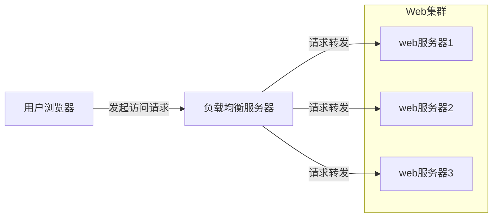

# 大型网站架构演化历程

## 初始阶段

应用程序+数据库+文件=一台服务器

## 应用服务于数据服务分类

应用服务器+文件服务器+数据库服务器

## 缓存

两种缓存：

1. 本地缓存

   优点：速度快

   缺点：容量有限

2. 缓存服务器

   优点：容量大，可扩容

   缺点：速度相对慢

## 使用应用服务器缓存

通过负载均衡调度。

实现系统可升缩性，简单成熟。

## 数据库读写分离

主从数据库。

## 使用反向代理和CDN

区别：

CDN在运营提供商的机房内。

反向代理在网站机房内。

## 使用分布式文件系统和分布式数据库

分布式数据库是网站数据库拆分的最后手段，更常用的数据库拆分手段是业务分库，将不同业务数据库部署在不同的物理服务器上。

## 使用NoSQL和搜索引擎

应用服务器通过一个统一数据访问模块访问各种数据。

## 业务拆分

拆分成不同的产品线

拆分成不同的应用

通过超链接建立关系、通过消息队列就行数据分发、通过访问同一个数据存储系统构成一个关联的完整系统。

## 分布式服务

将共用的业务提取出来，独立部署，有这些可复用的业务连接数据库，提供共用业务服务。

# 大型网站架构模式

## 分层

分层是逻辑上，不是物理上的。横向方面切分。

##  分割

纵向方面切分

## 分布式

1. 分布式应用和服务
2. 分布式静态资源
3. 分布式数据和存储
4. 分布式计算

## 集群

更好的并发特性、可用性

## 缓存

前提：

1. 数据访问热点不均衡
2. 数据有有效期

## 异步

生产者-消费者模型

1. 提高系统可用性
2. 加快网站响应速度
3. 消除并发访问高峰

## 冗余

集群

## 自动化

主要集中在发布运维方面

## 安全

# 大型网站核心架构要素

架构：最高层次的规划，难以改变的决定。

软件架构五要素：==性能、可用性、伸缩性、扩展性、安全性==

## 性能

很多时候，性能问题是网站架构升级优化的触发器。

提高方法：

- 浏览器：浏览器缓存、页面压缩、合理布局页面、减少Cookie传输
- 使用CDN
- 应用服务器端使用本地缓存和分布式缓存
- 通过异步操作将用户请求发送至消息队列等待后续任务处理
- 多台应用服务器组成集群
- 代码通过多线程、改善内存管理
- 数据库索引、缓存、SQL优化；NoSQL。

性能指标：

- 响应时间
- TPS
- 系统性能计数器

## 可用性

高可用性架构设计的前提：必然会出现服务器宕机，高可用性设计的目标是当服务器宕机后，服务或者应用仍然可用。

主要手段：==冗余==

- 应用服务器：组成集群（前提：应用服务器上不能保存请求的会话信息）
- 存储服务器：对数据实时备份
- 软件开发：过程保证质量（预发布验证、自动化测试、自动化发布、灰度发布）

## 伸缩性

指通过不断向集群中增加服务器的手段来缓解不断上升的用户并发访问压力和不断增长的数据存储需求。

衡量指标：

- 是否可以用多台服务器构建集群
- 是否容易向集群中添加新的服务器
- 加入新的服务器后是否可以提供和原来的服务器无差别的服务
- 集群中可容纳的总的服务器数量是否有限制

1. 应用服务器集群：只要服务器上不保存数据，通过使用合适的负载均衡设备就可以不断向集训加入服务器
2. 缓存服务器集群：新加入的服务器可能会导致缓存路由失效，进而导致集群中大部分缓存数据都无法访问。需改进路由缓存路由算法保证缓存数据的可访问性。
3. 关系数据库：很难做到大规模集群的可升缩性。必须在数据库外实现，通过路由分区等手段将部署有多个数据库的服务器组成一个集群。
4. NoSQL天生对可伸缩性的支持都非常好。

## 扩展性

目的：网站的架构能够快速响应需求变化

指标：网站增加新的业务产品时，是否可以实现对现有产品透明无影响，不做或很少改动就可上线。

手段：

- 时间驱动架构

  通常利用消息队列实现，将用户请求和其他业务事件构成消息发布队列，消息的处理者作为消费者从消息队列总获取消息进行处理。

- 分布式服务

  将业务和可复用服务分离开来，通分布式服务框架调用。新增产品通过先用可复用的服务实现自身的业务逻辑。

## 安全性

衡量标准：针对现存和潜在的各种攻击和窃密手段，是否有可靠的应对策略。

# 瞬时响应：网站的高新能架构

网站性能是客观的指标（不同的技术指标），同时也是主观的感受（不同的人感受不同）。

## 网站性能测试

是性能优化的前提和基础，也是优化结果的检查和度量标准。

### 不同视角下的网站性能

1. 用户视角

   浏览器上网站响应速度的快慢。机器快慢、网速、服务器处理、浏览器解析速度等。

2. 开发人员视角

   应用程序本身以及相关子系统性能

3. 运维人员视角

   基础设施性能和资源利用率

### 性能测试指标

1. 响应时间

   应用执行一个操作需要的时间。

   测试方法：模拟多次请求，得到总时间，求得一次请求的响应时间

2. 并发数

   系统能够同时处理请求的数目

   网站系统用户数》网站在线用户数》网站并发用户数

   测试方法：模拟多并发用户

3. 吞吐量

   单位时间内系统处理的请求数量（请求数/秒、页面数/秒、访问人数/天、处理的业务数/小时等）。

   TPS（每秒事务数）、HPS（每秒HTTP请求数）、QPS（每秒查询数）

4. 性能计数器

   描述服务器或操作系统的一些数据指标。

### 性能测试方法

- 性能测试
- 负载测试
- 压力测试
- 稳定性测试


### 性能测试报告


### 性能优化策略

1. 性能分析

   排查性能瓶颈：检查请求处理的各个环节的日志。检查监控数据。

2. 性能优化（见下面三节）

## Web前端性能优化

### 浏览器访问优化

1. 减少http请求

   合并CSS，JS，图片

2. 使用浏览器缓存

   设置HTTP头中的Cache-Control和Expires的属性。静态文件更新时，通过修改文件名迫使客户端更新。不应一次更新多个静态文件，大量客户端更新会造成服务器压力。

3. 启用压缩

   启用GZip，可能会对服务器和浏览器产生压力。

4. CSS放在页面最上面，JS放在页面最下面

5. 减少Cookie传输

### CDN加速

一般缓存静态文件，如图片、CSS、文件、Script脚本、静态网页等。

### 反向代理

作用：保护网站服务器安全、缓存资源从而加速Web请求


## 应用服务器性能优化

### 分布式缓存

==**网站性能优化第一定律：优先考虑使用缓存优化性能**==

1. 缓存的基本原理

   将数据存储在相对较高访问速度的存储介质中，以供系统处理。

   - 减少数据访问时间
   - 减少计算时间

   **缓存的本质是内存Hash表**，数据以一对Key、Value的形势存储在内存Hash表中，Hash表读写复杂度为Ｏ（１）。

   ```mermaid
   graph TD
   应用程序 -- 2.写入数据 --> id2((缓存));
   id2((缓存)) -- 3.读取数据 --> 应用程序;
   id1>数据库] -- 1.读取数据 --> 应用程序;
   ```

   

2. 合理使用缓存

   - 频繁修改的数据（读写比>2：1，缓存才有意义）
   - 没有热点访问（不遵循二八定律，缓存没有意义）
   - 数据不一致与脏读（缓存失效时间在接受范围内）
   - 缓存可用性（缓存服务器宕机，采用分布式缓存服务器集群）
   - 缓存预热（换粗系统启动时就把热点数据加载好）
   - 缓存穿透（将不存在数据进行缓存）

3. 分布式缓存架构

   架构方式：

   + 以JBoss Cache为代表的的需要更新同步的分布式缓存（所有服务器中保存相同的缓存数据，所有服务器同步更新）
   + 以Memcached为代表的不互相通信的分布式缓存（不同的服务器中的缓存数据不相同，应用程序自主选择缓存服务器位置）

4. Memcached

   ```mermaid
   graph TD
   subgraph memcached缓存集群
     id1(memcached服务器1);
     id2(memcached服务器2);
     id3(memcached服务器3);
   end
   应用服务器1 -- Memcached协议 --> id1(memcached服务器1);
   应用服务器1 -- Memcached协议 --> id2(memcached服务器2);
   应用服务器1 -- Memcached协议 --> id3(memcached服务器3);
   应用服务器2 -- Memcached协议 -->id1(memcached服务器1);
   应用服务器2 -- Memcached协议 --> id2(memcached服务器2);
   应用服务器2 -- Memcached协议 --> id3(memcached服务器3);
   ```

   + 简单的通信协议
   + 丰富的客户端程序
   + 高性能的网络通信
   + 高效的内存管理
   + 互不通信的服务器集群架构

### 异步操作


具有很好的削峰作用。

注意：消息放入消息队列后，不应马上返回结果给用户，因为有可能在处理消息的过程中出现错误。

==**任何可以晚点做的事情都应该晚点再做**==

### 使用集群



### 代码优化

1. 多线程

   原因：IO阻塞与多CPU

   启用线程数=[任务执行时间/（任务执行时间-IO等待时间）] X CPU内核数

   解决线程安全问题：

   + 讲对象设计为无状态对象
   + 使用局部变量
   + 并发访问资源时使用锁
   + 

2. 资源复用

   两种形式：单例（Singleton）和对象池

3. 数据结构

4. 垃圾回收

## 存储性能优化

### 机械硬盘 VS 固态硬盘

### B+树 VS LSM树

### RAID VS HDFS


# 万无一失：网站的高可用性架构


