# 大型网站架构演化历程

## 初始阶段

应用程序+数据库+文件=一台服务器

## 应用服务于数据服务分类

应用服务器+文件服务器+数据库服务器

## 缓存

两种缓存：

1. 本地缓存

   优点：速度快

   缺点：容量有限

2. 缓存服务器

   优点：容量大，可扩容

   缺点：速度相对慢

## 使用应用服务器缓存

通过负载均衡调度。

实现系统可升缩性，简单成熟。

## 数据库读写分离

主从数据库。

## 使用反向代理和CDN

区别：

CDN在运营提供商的机房内。

反向代理在网站机房内。

## 使用分布式文件系统和分布式数据库

分布式数据库是网站数据库拆分的最后手段，更常用的数据库拆分手段是业务分库，将不同业务数据库部署在不同的物理服务器上。

## 使用NoSQL和搜索引擎

应用服务器通过一个统一数据访问模块访问各种数据。

## 业务拆分

拆分成不同的产品线

拆分成不同的应用

通过超链接建立关系、通过消息队列就行数据分发、通过访问同一个数据存储系统构成一个关联的完整系统。

## 分布式服务

将共用的业务提取出来，独立部署，有这些可复用的业务连接数据库，提供共用业务服务。

# 大型网站架构模式

## 分层

分层是逻辑上，不是物理上的。横向方面切分。

##  分割

纵向方面切分

## 分布式

1. 分布式应用和服务
2. 分布式静态资源
3. 分布式数据和存储
4. 分布式计算

## 集群

更好的并发特性、可用性

## 缓存

前提：

1. 数据访问热点不均衡
2. 数据有有效期

## 异步

生产者-消费者模型

1. 提高系统可用性
2. 加快网站响应速度
3. 消除并发访问高峰

## 冗余

集群

## 自动化

主要集中在发布运维方面

## 安全

# 大型网站核心架构要素

架构：最高层次的规划，难以改变的决定。

软件架构五要素：==性能、可用性、伸缩性、扩展性、安全性==

## 性能

很多时候，性能问题是网站架构升级优化的触发器。

提高方法：

- 浏览器：浏览器缓存、页面压缩、合理布局页面、减少Cookie传输
- 使用CDN
- 应用服务器端使用本地缓存和分布式缓存
- 通过异步操作将用户请求发送至消息队列等待后续任务处理
- 多台应用服务器组成集群
- 代码通过多线程、改善内存管理
- 数据库索引、缓存、SQL优化；NoSQL。

性能指标：

- 响应时间
- TPS
- 系统性能计数器

## 可用性

高可用性架构设计的前提：必然会出现服务器宕机，高可用性设计的目标是当服务器宕机后，服务或者应用仍然可用。

主要手段：==冗余==

- 应用服务器：组成集群（前提：应用服务器上不能保存请求的会话信息）
- 存储服务器：对数据实时备份
- 软件开发：过程保证质量（预发布验证、自动化测试、自动化发布、灰度发布）

## 伸缩性

指通过不断向集群中增加服务器的手段来缓解不断上升的用户并发访问压力和不断增长的数据存储需求。

衡量指标：

- 是否可以用多台服务器构建集群
- 是否容易向集群中添加新的服务器
- 加入新的服务器后是否可以提供和原来的服务器无差别的服务
- 集群中可容纳的总的服务器数量是否有限制

1. 应用服务器集群：只要服务器上不保存数据，通过使用合适的负载均衡设备就可以不断向集训加入服务器
2. 缓存服务器集群：新加入的服务器可能会导致缓存路由失效，进而导致集群中大部分缓存数据都无法访问。需改进路由缓存路由算法保证缓存数据的可访问性。
3. 关系数据库：很难做到大规模集群的可升缩性。必须在数据库外实现，通过路由分区等手段将部署有多个数据库的服务器组成一个集群。
4. NoSQL天生对可伸缩性的支持都非常好。

## 扩展性

目的：网站的架构能够快速响应需求变化

指标：网站增加新的业务产品时，是否可以实现对现有产品透明无影响，不做或很少改动就可上线。

手段：

- 时间驱动架构

  通常利用消息队列实现，将用户请求和其他业务事件构成消息发布队列，消息的处理者作为消费者从消息队列总获取消息进行处理。

- 分布式服务

  将业务和可复用服务分离开来，通分布式服务框架调用。新增产品通过先用可复用的服务实现自身的业务逻辑。

## 安全性

衡量标准：针对现存和潜在的各种攻击和窃密手段，是否有可靠的应对策略。

# 瞬时响应：网站的高新能架构

网站性能是客观的指标（不同的技术指标），同时也是主观的感受（不同的人感受不同）。

## 网站性能测试

是性能优化的前提和基础，也是优化结果的检查和度量标准。

### 不同视角下的网站性能

1. 用户视角

   浏览器上网站响应速度的快慢。机器快慢、网速、服务器处理、浏览器解析速度等。

2. 开发人员视角

   应用程序本身以及相关子系统性能

3. 运维人员视角

   基础设施性能和资源利用率

### 性能测试指标

1. 响应时间

   应用执行一个操作需要的时间。

   测试方法：模拟多次请求，得到总时间，求得一次请求的响应时间

2. 并发数

   系统能够同时处理请求的数目

   网站系统用户数》网站在线用户数》网站并发用户数

   测试方法：模拟多并发用户

3. 吞吐量

   单位时间内系统处理的请求数量（请求数/秒、页面数/秒、访问人数/天、处理的业务数/小时等）。

   TPS（每秒事务数）、HPS（每秒HTTP请求数）、QPS（每秒查询数）

4. 性能计数器

   描述服务器或操作系统的一些数据指标。

### 性能测试方法

- 性能测试
- 负载测试
- 压力测试
- 稳定性测试


### 性能测试报告


### 性能优化策略

1. 性能分析

   排查性能瓶颈：检查请求处理的各个环节的日志。检查监控数据。

2. 性能优化（见下面三节）

## Web前端性能优化

### 浏览器访问优化

1. 减少http请求

   合并CSS，JS，图片

2. 使用浏览器缓存

   设置HTTP头中的Cache-Control和Expires的属性。静态文件更新时，通过修改文件名迫使客户端更新。不应一次更新多个静态文件，大量客户端更新会造成服务器压力。

3. 启用压缩

   启用GZip，可能会对服务器和浏览器产生压力。

4. CSS放在页面最上面，JS放在页面最下面

5. 减少Cookie传输

### CDN加速

一般缓存静态文件，如图片、CSS、文件、Script脚本、静态网页等。

### 反向代理

作用：保护网站服务器安全、缓存资源从而加速Web请求


## 应用服务器性能优化

### 分布式缓存

==**网站性能优化第一定律：优先考虑使用缓存优化性能**==

1. 缓存的基本原理

   将数据存储在相对较高访问速度的存储介质中，以供系统处理。

   - 减少数据访问时间
   - 减少计算时间

   **缓存的本质是内存Hash表**，数据以一对Key、Value的形势存储在内存Hash表中，Hash表读写复杂度为Ｏ（１）。

   ```mermaid
   graph TD
   应用程序 -- 2.写入数据 --> id2((缓存));
   id2((缓存)) -- 3.读取数据 --> 应用程序;
   id1>数据库] -- 1.读取数据 --> 应用程序;
   ```

   

2. 合理使用缓存

   - 频繁修改的数据（读写比>2：1，缓存才有意义）
   - 没有热点访问（不遵循二八定律，缓存没有意义）
   - 数据不一致与脏读（缓存失效时间在接受范围内）
   - 缓存可用性（缓存服务器宕机，采用分布式缓存服务器集群）
   - 缓存预热（换粗系统启动时就把热点数据加载好）
   - 缓存穿透（将不存在数据进行缓存）

3. 分布式缓存架构

   架构方式：

   + 以JBoss Cache为代表的的需要更新同步的分布式缓存（所有服务器中保存相同的缓存数据，所有服务器同步更新）
   + 以Memcached为代表的不互相通信的分布式缓存（不同的服务器中的缓存数据不相同，应用程序自主选择缓存服务器位置）

4. Memcached

   ```mermaid
   graph TD
   subgraph memcached缓存集群
     id1(memcached服务器1);
     id2(memcached服务器2);
     id3(memcached服务器3);
   end
   应用服务器1 -- Memcached协议 --> id1(memcached服务器1);
   应用服务器1 -- Memcached协议 --> id2(memcached服务器2);
   应用服务器1 -- Memcached协议 --> id3(memcached服务器3);
   应用服务器2 -- Memcached协议 -->id1(memcached服务器1);
   应用服务器2 -- Memcached协议 --> id2(memcached服务器2);
   应用服务器2 -- Memcached协议 --> id3(memcached服务器3);
   ```

   + 简单的通信协议
   + 丰富的客户端程序
   + 高性能的网络通信
   + 高效的内存管理
   + 互不通信的服务器集群架构

### 异步操作


具有很好的削峰作用。

注意：消息放入消息队列后，不应马上返回结果给用户，因为有可能在处理消息的过程中出现错误。

==**任何可以晚点做的事情都应该晚点再做**==

### 使用集群

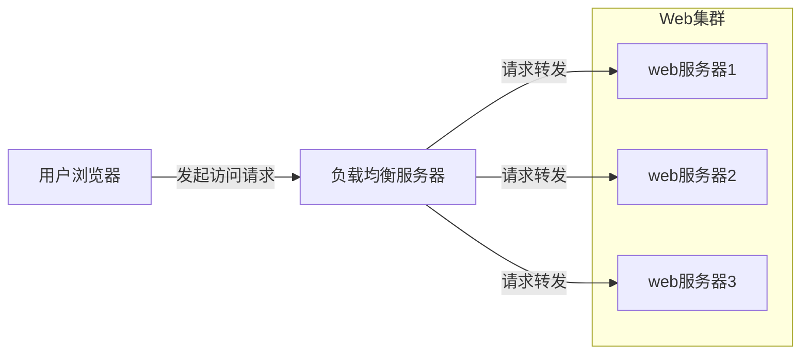

### 代码优化

1. 多线程

   原因：IO阻塞与多CPU

   启用线程数=[任务执行时间/（任务执行时间-IO等待时间）] X CPU内核数

   解决线程安全问题：

   + 讲对象设计为无状态对象
   + 使用局部变量
   + 并发访问资源时使用锁
   + 

2. 资源复用

   两种形式：单例（Singleton）和对象池

3. 数据结构

4. 垃圾回收

## 存储性能优化

### 机械硬盘 VS 固态硬盘

### B+树 VS LSM树

### RAID VS HDFS


# 万无一失：网站的高可用性架构


网站的可用性（Availability）描述网站可有效访问的特性。

## 网站可用性的度量与考核

### 网站可用性度量

网站不可用时间（故障时间）=故障修复时间点-故障发现（报告）时间点

网站年度可用性指标=（1-网站不可用时间/年度总时间）X100%

### 网站可用性考核

故障分是指对网站故障进行分类加权计算故障责任的方法。

故障分=故障时间（分钟）X 故障权重

## 高可用的网站架构

大型网站的分层架构及物理服务器的分布式部署使得卫浴不同层次的服务器具有不同的可用性特点。关闭服务或者服务器宕机时产生的影响也不相同，高可用性的解决方案也差异甚大。

## 高可用的应用

### 通过负载均衡进行无状态服务的失效转移

### 应用服务器集群的Session管理

1. Session复制
2. Session绑定
3. 利用Cookie记录Session
4. Session服务器

## 高可用的服务

1. 分级管理（优先级）
2. 超时设置（设置服务调用的超时时间）
3. 异步调用
4. 服务降级
5. 幂等性设计

## 高可用的数据

主要手段：数据备份和失效转移机制

### CPA原理

+ 数据持久性
+ 数据可访问性
+ 数据一致性

CPA原理认为：一个提供数据服务的存储系统无法同时满足数据一致性（Consistency）、数据可用性（Availiblity）、分区耐受性（Patition Tolerance）这三个条件。

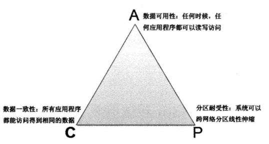

大型网站中，可升缩性即分区耐受性必不可少（快速扩张），必须保证分布式处理系统的高可用性。因此，大型网站通常会选择强化分布式存储系统的可用性（A）和伸缩性（P），而在某种程度上放弃一致性（C）。

数据一致性又可分为如下几点：

+ 数据强一致（各个副本总是一致）
+ 数据用户一致（返回给用户的数据一致）
+ 数据最终一致（最终达到数据一致）

### 数据备份

冷备份：简单廉价，但不能保证数据最终一致和数据可用性。

热备份：异步热备和同步热备

### 失效转移

三部分组成：失效确认、访问转移、数据恢复

1. 失效确认：心跳检测和应用程序访问失败报告
2. 访问转移
3. 数据恢复

## 高可用性网站的软件质量保证

### 网站发布

### 自动化测试

Selenium测试软件

### 预发布验证

预发布服务器与线上正式服务器部署在相同的物理环境，使用相同的线上配置，以来相同的外部服务。工程师通过修改hosts文件把绑定域名IP关系，之际二用IP地址访问。唯一不同的就是没有配置在负载均衡服务器上，外部用户无法访问。

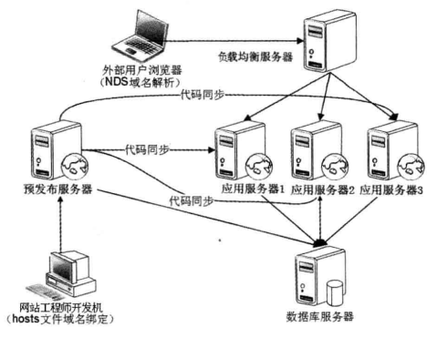

### 代码控制

1. 主干开发，分支发布
2. 分支开发，主干发布（主要方式）

git工具

### 自动化发布

周四发布（有时间准备，有时间纠错）

火车发布模型

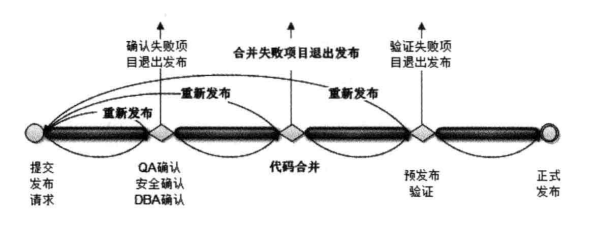

### 灰度发布

出现故障，发布回滚。讲集群服务器分成若干部分，每天只发布一部分服务器，观察运行情况，没有问题了继续发布一部分服务器，直到发布完成。

## 网站运行监控

==**不允许没有监控的系统上线**==

### 监控数据采集

1. 用户行为日志收集

   + 服务器端日志收集
   + 客户端浏览器日志收集

   [实时计算框架Storm介绍](https://blog.csdn.net/qq_33314107/article/details/80890939)

2. 服务器性能监控

   [Ganglia介绍](https://www.cnblogs.com/yuki-lau/p/3201110.html)

3. 运行数据报告

### 监控管理

+ 系统报警
+ 失效转移
+ 自动优雅降级

# 永无止境：网站的伸缩性架构

网站的伸缩性是指不需要改变网站的软硬件设计，仅仅通过改变部署的服务器数量就可以扩大或者缩小网站的服务处理能力。

## 网站架构的伸缩性设计

### 不同功能进行物理分离实现伸缩

+ 纵向分离（先业务分层再分离）
+ 横向分离（先业务分割再分离）

### 单一功能通过集群规模实现伸缩

==当一头牛拉不动车的时候，不要去寻找已投更强壮的牛，而是用两头牛来拉==

集群伸缩性分类：

+ 应用服务器集群伸缩性
+ 数据服务区集群伸缩性（缓存服务器集群、存储服务器集群的伸缩性设计也不同）

## 应用服务器集群的伸缩性设计

### HTTP重定向负载均衡

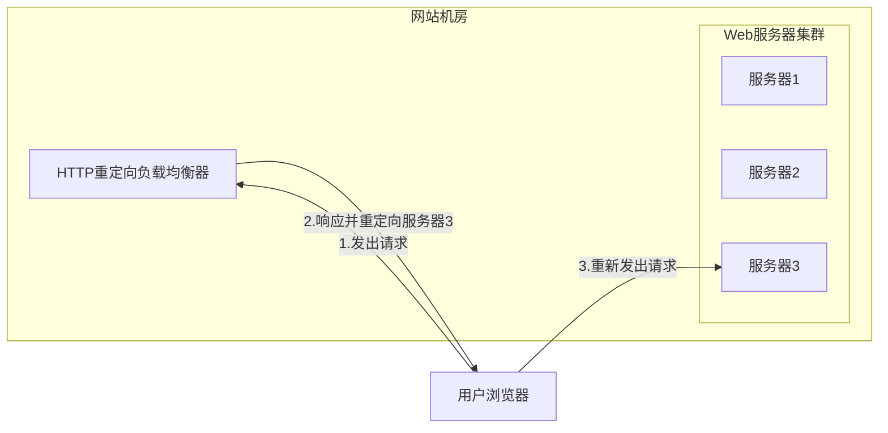

+ 优点：简单
+ 缺点：性能差（需两次请求，重定向服务器瓶颈，SEO作弊嫌疑）

此种方式较少使用！

### DNS域名解析负载均衡

DNS配置多条A记录，对每次相同的域名请求，根据均衡算法返回不同的IP地址。

+ 优点：交给DNS处理，省去维护均衡服务器的麻烦；支持基于地理位置的域名解析。
+ 缺点：生效时间长，控制权不在自己手里。

部分使用DNS域名解析（一级均衡）-->解析地址为负载均衡服务器地址（二级均衡）-->得到真实web服务器地址返回

### 反向代理负载均衡

+ 优点：简单

+ 缺点：服务器瓶颈

### IP负载均衡

在网络层通过修改请求目标地址进行负载均衡。作为网关，直接修改数据包目的IP。

### 数据链路层负载均衡

又称作三角传输模式（或直接路由方式DR），负载均衡器不修改IP，只修改目的MAC地址，真实物理服务器集群所有机器虚拟IP和负载均很服务器IP地址一致。

使用最广的手段，Linux Virtual Server（LVS）。

### 负载均衡算法

负载均衡服务器的实现步骤：

1. 根据算法和Web服务器列表计算得到一个IP地址
2. 转发数据到这个IP

均衡算法：

+ 轮训（RR）
+ 加权轮训（WRR）
+ 随机（Random）
+ 最少链接（Least Connections）
+ 原地址散列（Source Hashing）

## 分布式缓存集群的伸缩性设计

不能使用简单的负载均衡手段来实现（因为各个缓存服务器中缓存的数据各不相同）。

### Memcached分布式缓存集群的访问模型

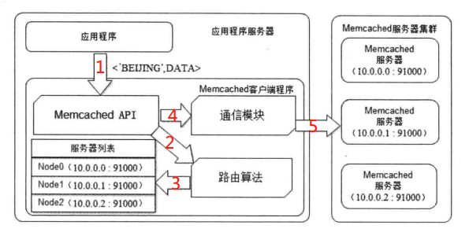

### Memcached分布式缓存集群的伸缩性挑战

路由算法至关重要。使用余数Hash可满足大多数场景。但当分布式缓存集群需要扩容的时候，问题棘手了，因为增加的服务器使得余数发生变化，缓存命中率大大下降。

### 分布式缓存的一致性Hash算法

一致性Hash环？？？

## 数据存储服务器集群的伸缩性设计

### 关系数据库集群的伸缩性设计

主/从模式，读写分离

数据库访问代理：

+ [Amoeba](https://www.cnblogs.com/liuyisai/p/6009379.html)
+ [Cobar](https://www.cnblogs.com/hyace/p/4169136.html)

### NoSQL数据库的伸缩性升级

[Apach HBase](https://hbase.apache.org/)

# 随需应变：网站的课扩展性架构

## 构建可扩展的网站架构

设计网站可扩展架构的核心思想是模块化，并在此基础上，降低模块间的耦合性，提高模块的复用性。

## 利用分布式消息队列降低系统耦合性

### 事件驱动构架

事件驱动构建（Event Driven Architecture）：通过在低耦合的模块之间传输时间消息，已保持模块的松散耦合，并借助事件消息的通信完成模块间合作，典型的EDA架构就是操作系统中常见的生产者消费者模型。

### 分布式消息队列

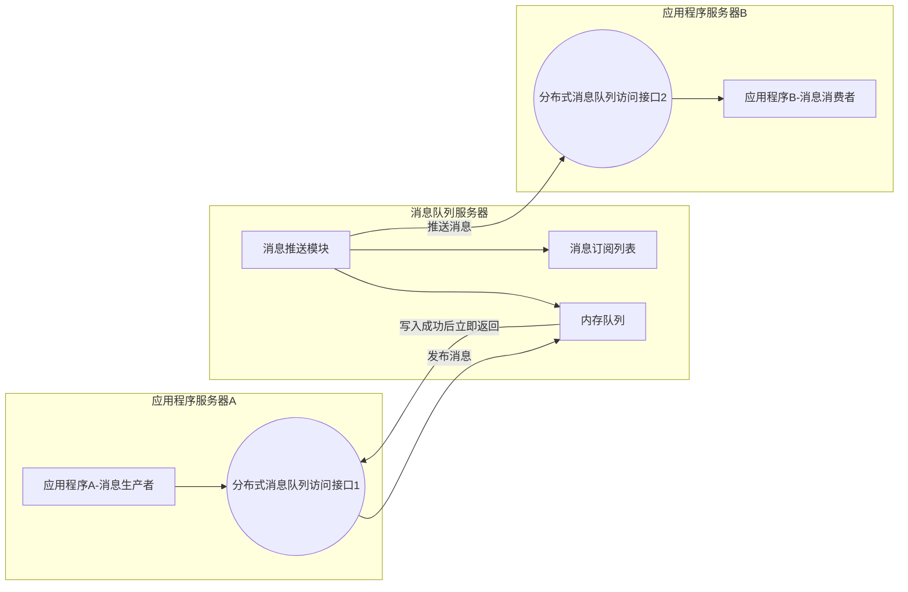

通过消息对象分解系统耦合性，不同子系统处理同一个消息。比较著名的产品：Apach ActiveMQ

## 利用分布式服务打造可复用的业务平台

通过接口分解系统耦合性，不同子系统通过相同的接口描述进行服务调用。

### Web Service与企业级分布式服务

Web Service原理架构：

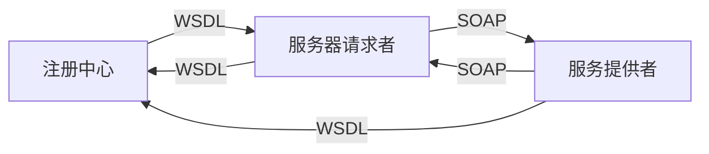

### 大型网站分布式服务的需求与特点

+ 负载均衡
+ 失效转移
+ 高效的远程通信
+ 整合异构系统
+ 对应用最少侵入
+ 版本管理
+ 实时监控

### 分布式服务框架设计

Facebook利用Thrift管理器分布式服务。

[阿里巴巴开源Dubbo](https://www.jianshu.com/p/292fcdcfe41e)

## 可扩展的数据结构

NoSQL数据库使用ColumnFamily（列族）

## 利用开放平台建设网站生态圈

+ API接口
+ 协议转换
+ 安全
+ 审计
+ 路由
+ 流程

# 固若金汤：网站的安全架构

## 道高一尺魔高一丈的网站应用攻击与防御

### XSS攻击

即跨站点脚本攻击（Cross Site Script）。

防范：

+ 过滤消毒（危险字符转义）
+ HttpOnly

### 注入攻击

SQL注入攻击和OS注入攻击

SQL注入攻击获得网站数据库结构手段：

+ 开源
+ 错误回显
+ 盲注

防范方法：

+ 过滤消毒
+ 参数绑定

### CSRF攻击

跨站请求伪造（Cross Site Request Forgery），攻击通过跨站请求，已合法的用户身份进行非法操作。

防范方法：

+ 表单Token
+ 验证码
+ Referer check

### 其他攻击行业漏洞

+ Error Code
+ HTML注释
+ 文件上传
+ 路径遍历

### Web应用防火墙

ModSecurity：开源应用防火墙

### 网站安全漏洞扫码

## 信息加密技术及秘钥安全管理

### 单向散列加密

MD5，SHA

### 对称加密

DES，RC

### 非对称加密

RSA。

### 秘钥安全管理

## 信息过滤与反垃圾

### 文本匹配

### 分类算法

### 黑名单

## 电子商务风险控制

### 风险

+ 账户风险
+ 买家风险
+ 麦家风险
+ 交易风险

### 风控

1. 规则引擎
2. 统计模型

# 淘宝网的架构演化案例分析

# 维基百科的高新能架构设计分析

## Wikipedia网站整体架构

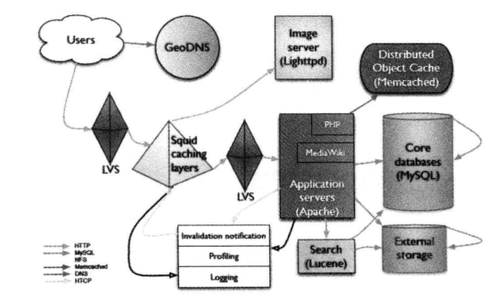

GeoDNS：基于开源域名服务器软件BIND的增强版本，可将域名解析到离用户最近的服务器。

LVS：基于Linux的开源负载均衡服务器。

Squid：基于Linux的开源反向代理服务器。

Lighttpd：开源的应用服务器，交主流的Apach服务器更轻量、更快速。许多网站使用它作为图片服务器。

PHP：Web应用程序开发语言。

Memcached：无中心高性能的开源分布式缓存系统。

Lucene：Apach出品Java开发的开源全文搜索引擎。

MySQL：开源关系数据库管理系统。

## Wikipedia性能优化策略

### Wikipedia前端性能优化

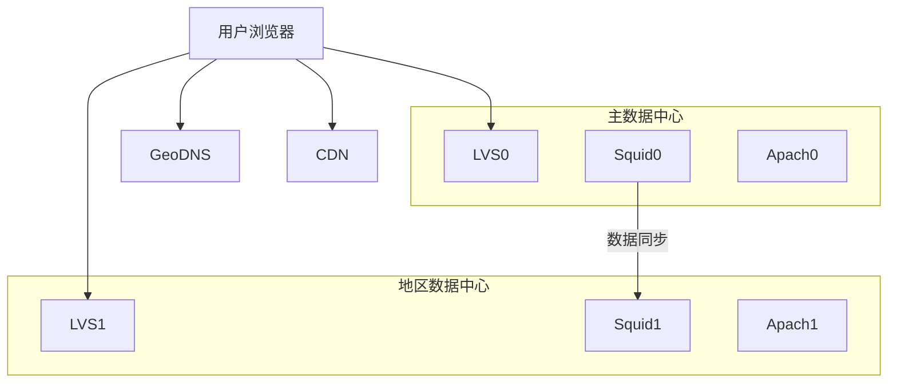

前端架构的核心是反向代理服务器Squid集群。请求通过LVS负载均衡分发到每台Squid服务器，大量请求可直接返回响应。

在反向代理Squid之前，是CDN服务。几条原则：

+ 内容页面不包含动态信息
+ 每个内容页面有唯一的REST风格的URL
+ 在HTML响应头写入缓存控制信息

### Wikipedia服务端性能优化

PHP优化：

+ 使用APC（字节码缓存模块）
+ 使用Imaemagick就行图片处理和转化
+ 使用Text进行文本格式化，特别是将科学公式内容转换成图片格式
+ 替换PHP的祖父穿查找函数strtr()，使用更优化的算法重构

### Wikipedia后端性能优化

主要手段是使用缓存。缓存使用策略：

+ 热点特别集中的数据直接缓存到应用服务器的本地内存中
+ 缓存数据的内容尽量是应用服务器可以直接使用的格式
+ 使用缓存服务器存储session对象
+ 相比数据库，Memcached的持久化连接非常廉价，如有需要就创建一个Memcached连接

MySQL数据库优化：

+ 使用较大的服务器内存
+ 使用RAID0磁盘阵列加速磁盘访问
+ 将数据库事务一致性设置在较低水平，加快宕机恢复速度
+ 如果Master数据库宕机，立即将应用切换到Slave数据库，同时关闭数据写服务。

# 海量分布式存储系统Doris的高可用性架构设计分析

对弈个数据存储系统而言，高可用性意味着：

+ 高可用的服务
+ 高可靠的数据

## 分布式存储系统的高可用构架

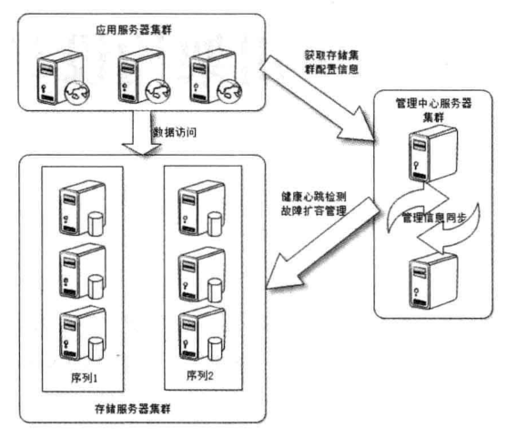

## 不同故障情况下的高可用解决方案

### 分布式存储系统的故障分类

+ 瞬时故障
+ 临时故障
+ 永久故障

### 正常情况下系统访问结构

应用程序在写数据时，需要路有计算获得两台不同的服务器，同时将数据写入两台服务器；读数据时，只需要到这两台服务器上任意一台服务器读取即可。

### 瞬时故障的高可用解决方案

一般经过较短的时间即可自行恢复。

### 临时故障的高可用解决方案

需人工干预。

### 永久故障的高可用解决方案

必须从其他序列中正常的服务器中复制全部数据才能恢复正常。

#  网购秒杀系统架构设计案例分析

## 秒杀活动的技术挑战

1. 对现有网站业务造成冲击
2. 高并发下的应用、数据库负载
3. 突然增加的网络及服务器带宽
4. 直接下单

## 秒杀系统的应对策略

1. 秒杀系统独立部署
2. 秒杀商品页面静态化
3. 租借秒杀活动网络带宽
4. 动态生成随机下单页面URL

## 秒杀系统架构设计

1. 如何控制秒杀商品页面购买按钮的点亮
2. 如何治允许第一个提交的订单被发送到订单子系统

# 大型网站典型故障案例分析

## 写日志也会引发故障

经验教训：

+ 应用程序自己的日志输出配置和第三方组件日志输出要分别配置
+ 检查log配置文件，日志输出级别至少为Warn，并且检查log输出代码调用，调用级要符合其真实日志级别
+ 有些开源的第三方组件也会不恰当的输出太多的Error日志，需要关闭这些第三库的日志输出。

## 高并发访问数据库引发的故障

经验教训：

+ 首页不应该访问数据库，首页需要的数据可以从缓存服务器或者搜索引擎服务器获得
+ 首页最好是静态的

## 高并发情况下锁引发的故障

经验教训：

+ 使用锁操作要谨慎

## 缓存引发的故障

经验教训：

+ 当缓存已经不仅仅是改善性能，而是成为网站架构不可或缺的一部分时，对缓存的管理就需要提高到和其他服务器一样的级别

## 应用启动不同步引发的故障

经验教训：

+ 老鸨开门前要检查下姑娘们是否穿好了衣服。后台服务先准备好，前台应用才能启动。

## 大文件读写独占磁盘引发的故障

经验教训：

+ 存储的使用需要根据不同文件类型和用途进行管理，如图片应使用专用的图片存储服务器，不能和大文件共用存储

## 滥用生产环境引发的故障

经验教训：

+ 访问线上生产环境要规范，不小心就会导致大事故

## 不规范的流程引发的故障

经验教训：

+ 代码提交之前使用diff命令就行代码比较，确认没有提交不该提交的代码
+ 加强code review，代码在正式提交前必须被至少一个其他工程师做过code revies，并且共同承担因代码引起的故障责任

## 不好的编程习惯引发的故障

经验教训：

+ 程序在处理一个输入的对象时，如果不能明确该对象是否为空，必须做空指针判断
+ 程序在调用其他方法时，输入的对象尽量保证不是null，必要时构造空对象（使用空对象模式）

# 架构师领导艺术

